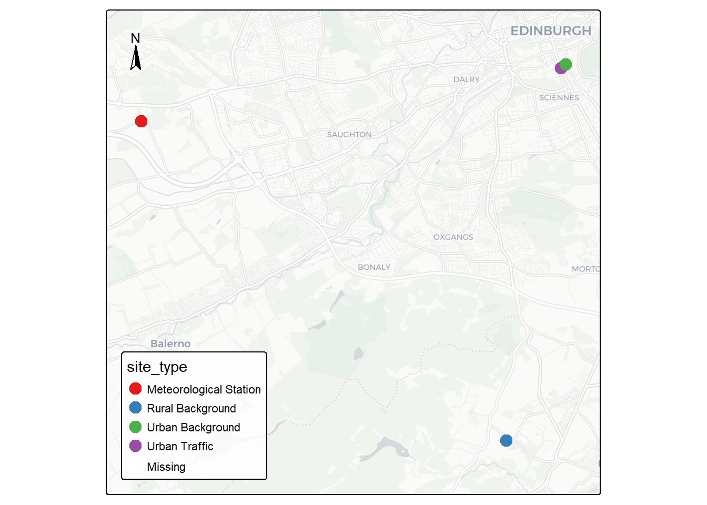
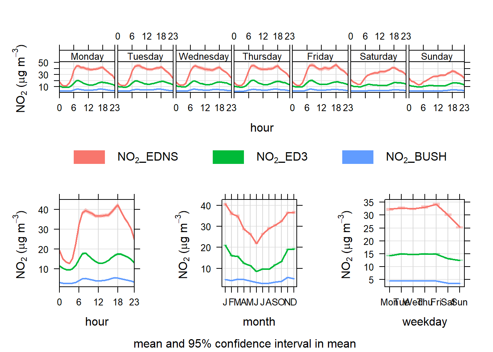
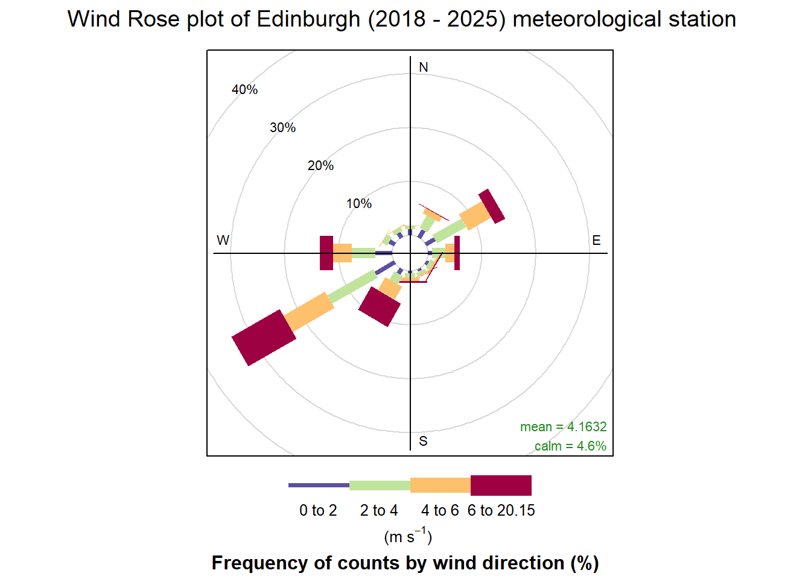
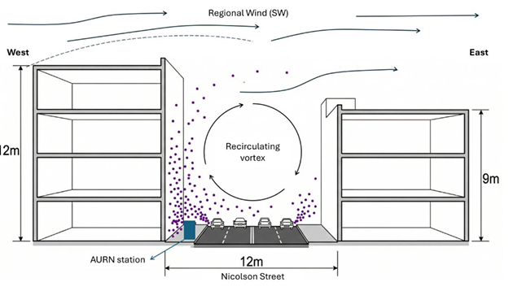
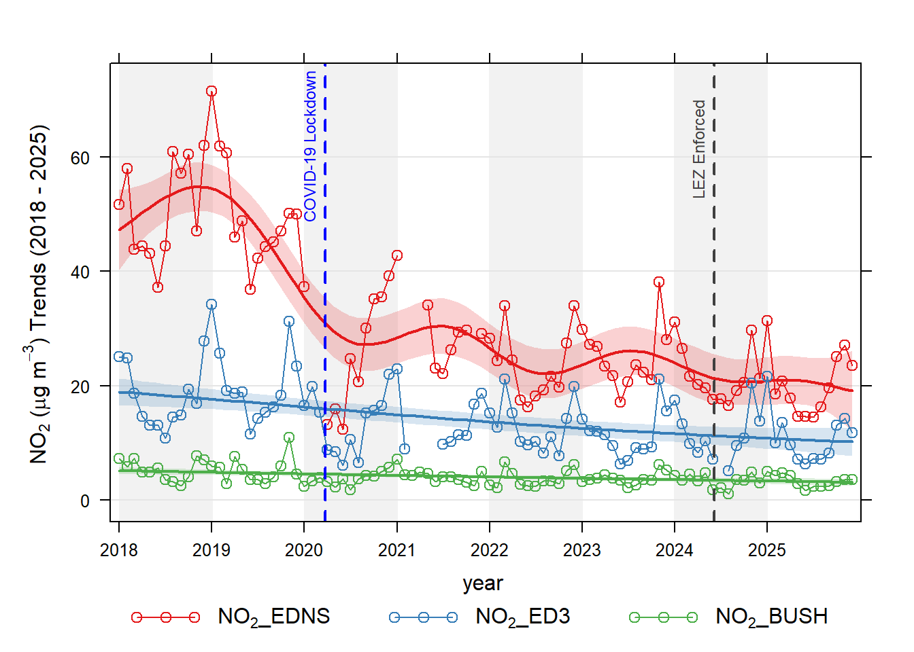
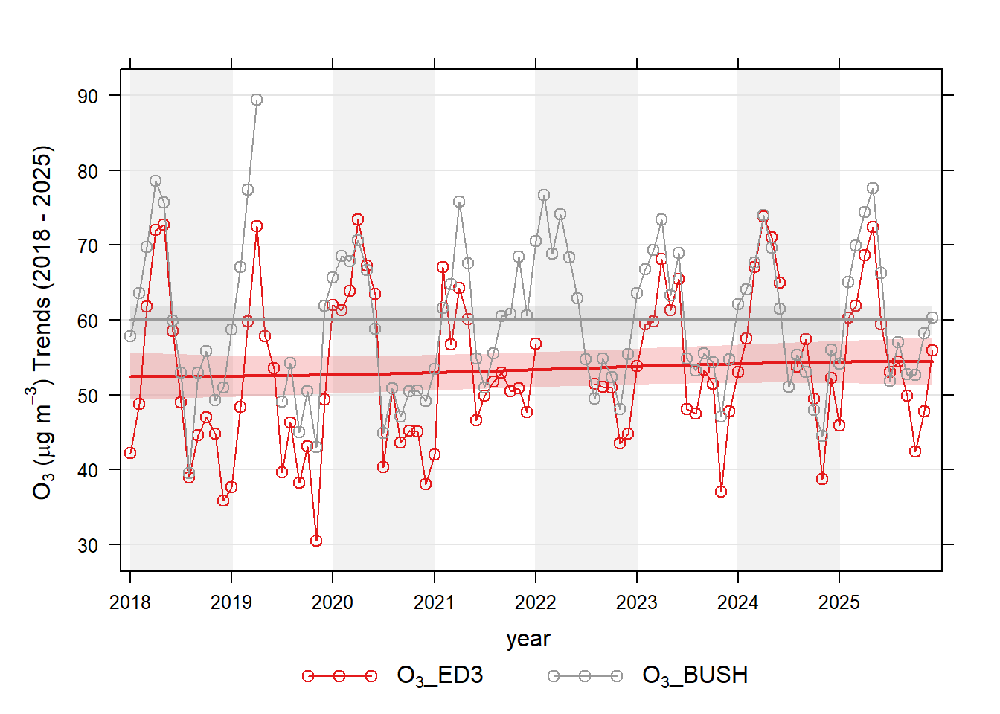
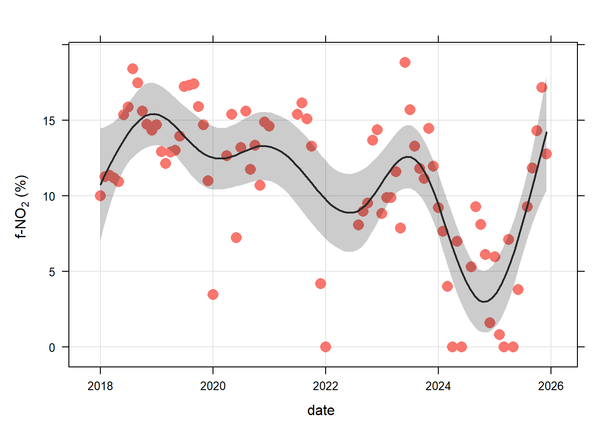

# Overview

Nitrogen dioxide (NO2) remains a critical air quality and public health challenge in UK urban centres, strongly linked to respiratory illness and driven primarily by localised road traffic emissions. This report analyses long-term air quality and meteorological data (2018–2025) across Edinburgh to evaluate the dispersion dynamics and source contributions of this pollutant. By examining the impact of local airflow processes and recent transport interventions—including the 2020 COVID-19 lockdown restrictions and the 2024 Low Emission Zone (LEZ)—this summary evaluates the efficacy of urban transport policies on localised NO2 concentrations.

{fig-align="center"}

# Methodology

The study integrates air quality and meteorological data from four monitoring sites representing different exposure environments: Urban Traffic (Edinburgh Nicolson Street), Urban Background (Edinburgh St Leonards), Rural Background (Bush Estate), and the Edinburgh Airport meteorological station. Utilising the R-based ‘openair’ project framework, spatial subtraction analysis and deseasonalised trend analyses were conducted to separate the street-level pollution increment from city-wide and regional baselines, allowing for a precise evaluation of tailpipe emission behaviours within urban geometries.

{fig-align="center"}

{fig-align="center"}

# Key findings

The Skimming Regime Behaviour: The Urban Traffic site at Nicolson Street operates as a dense 'street canyon' with a height-to-width (H/W) ratio of approximately 1.0. Prevailing southwest winds fail to penetrate the street level, creating a "skimming flow" and a recirculating vortex that traps vehicular emissions directly within the pedestrian area.

{fig-align="center"}

Local Source Dominance: Spatial subtraction analysis demonstrates that the localised street increment constitutes the vast majority of NO2 concentrations. While regional and city-background contributions remained minor and stable over time, the street increment proved to be highly sensitive to local transport policies.

{fig-align="center"}

{fig-align="center"}

Primary NO2 Fraction: An estimated primary f-NO2 fraction of 10-15% indicates a significant presence of diesel vehicles, heavy goods vehicles (HGVs), and buses. Notably, the implementation of the Edinburgh LEZ has already demonstrated a measurable reduction of the f-NO2 at the Urban Traffic site located within its boundary.

{fig-align="center"}

# Policy Implications and limitations

While COVID-19 restrictions temporarily reduced local NO2 levels in 2020, achieving sustained compliance requires proactive and permanent traffic management. The analysis highlights that future policy must aggressively target localised vehicle emissions rather than relying on regional improvements.

It is recommended that the City of Edinburgh Council maintains and expands upon the active travel infrastructure developed during the pandemic (e.g., the ‘Spaces for People’ project). Future investments should prioritise road-space reallocation to suppress general traffic volumes, increase pedestrianisation, and improve public transit connectivity. Furthermore, the strict enforcement of the June 2024 LEZ—which specifically targets pre-Euro 6 diesel vehicles—is essential. The Council should also evaluate the potential expansion of the LEZ boundaries to further limit vehicles with high f-NO2 fractions.

# Conclusions

Understanding local dispersion dynamics is critical for effective transport policy. The combination of dense urban street canyons and a reliance on diesel-heavy transport creates persistent pollution hotspots that regional interventions cannot resolve. To protect public health over the long term, Edinburgh must sustain its transition toward active travel and strictly enforce emission-based vehicular restrictions to maintain safe NO2 concentration levels within its most heavily trafficked corridors.
