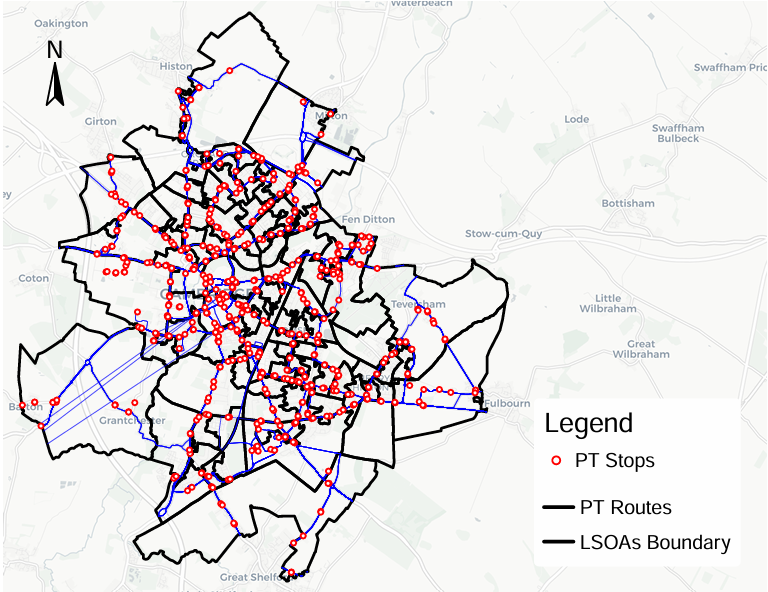
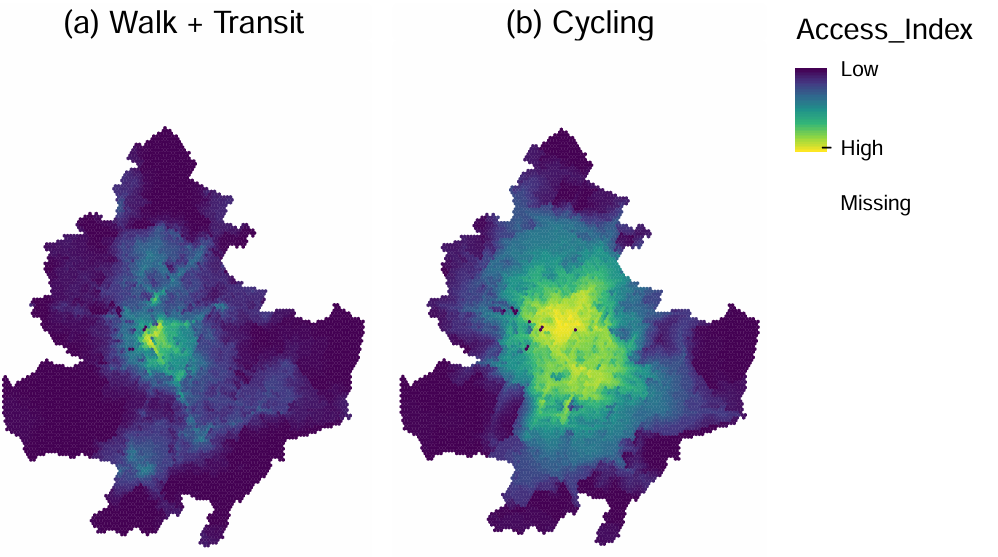
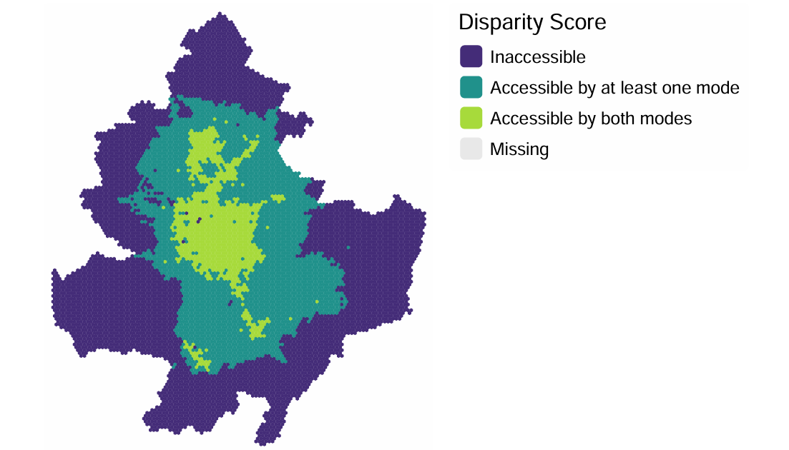

# Background and Objectives

In 2023, Cambridgeshire County Council introduced an active travel strategy to achieve net-zero carbon emissions by 2045, aligning with the 15-minute city framework. This report evaluates the spatial and socio-economic equity impacts of a 20-minute active travel strategy across the urban and peri-urban areas of Cambridge. The primary objectives are to develop a multimodal routing engine, identify areas lacking access to essential Points of Interest (POIs), and analyze the correlation between transport accessibility and social exclusion.

{fig-align="center"}

# Methodology

The study defines its working area using a 5km buffer around the geometric center of Cambridge, discretizing the environment into a high-resolution 100-meter hexagonal grid.

-   The `r5r` package was utilized as the multimodal routing engine to calculate travel times for walking, cycling, and public transport modes.

-   The model integrates OpenStreetMap network and POI data, General Transit Feed Specification (GTFS) public transport schedules for the East Anglia region, and topographical elevation models.

-   Accessibility was measured against a strict 20-minute time threshold (utilizing a step decay function) to four equally weighted POI categories: healthcare, education, supermarkets, and leisure.

-   Scores were normalized using a min-max formula ($x_{norm} = \frac{x - x_{min}}{x_{max} - x_{min}}$) and aggregated to the Lower Super Output Area (LSOA) level to compare against the Index of Multiple Deprivation (IMD).

# Key Findings: Spatial Accessibility

{fig-align="center"}

-   The spatial analysis reveals significant disparities depending on the mode of transport analyzed:

-   While the city center enjoys the highest accessibility levels across all modes, public transport accessibility drops off sharply outside this central radius.

-   Cycling demonstrates a highly resilient and dispersed spatial pattern, maintaining strong accessibility levels outward into the peri-urban areas.

-   Increasing the public transport time threshold from 20 to 30 minutes improves coverage but still fails to close the accessibility gap when compared to the efficiency of the cycling network.

# Key Findings: Socio-Economic Equity

{fig-align="center"}

-   Aggregating the spatial data with 2025 IMD deciles uncovers distinct transport social exclusion trends.

-   There is a clear positive correlation between cycling accessibility and LSOA deprivation levels; the most deprived areas consistently exhibit the lowest active travel accessibility.

-   Conversely, public transport accessibility does not display a clear relationship with deprivation levels across the analyzed zones.

-   A significant proportion of the population residing in Cambridge's peripheral and highly deprived areas remains completely excluded from accessing essential opportunities within 20 minutes.

# Limitations and Policy Recommendations

The study acknowledges methodological limitations, including the use of theoretical GTFS timetables that ignore real-time congestion delays, the aggregation of data to LSOAs which can obscure micro-level neighborhood variations, and the omission of perceived safety factors (e.g., traffic stress) in the cycling index calculation.

To address the identified socio-spatial gap, local authorities are advised to implement targeted, data-driven interventions in peripheral and deprived zones. Recommended strategies include expanding bike-share schemes, physically improving active travel infrastructure, and enhancing public transport schedules to ensure equitable access across the entirety of Cambridge.
